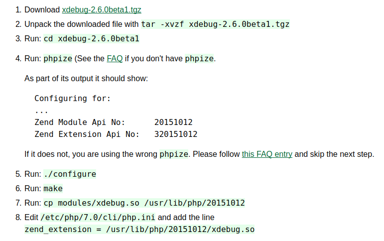
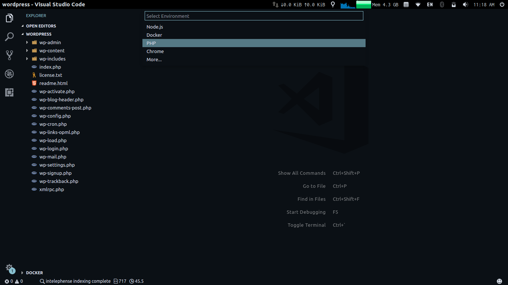

Sometimes we get away with having the program print out some information by executing commands like console.log for JS or echo, var_dump for PHP, and so on.

But as things get more complicated, you might need to get a better look at what is going on underneath the hood. Have a interactive debugging tool which allows you to inspect different variables as the program is executing and step through functions and control flow by adding certain breakpoint.

Setting up xdebug and php development with Apache is a lot of pain. Since the WordPress application code is running through Apache and we’re not launching it using Visual Studio Code itself, we need to ‘attach’ the debugger to the PHP process.

Following are the steps to enable debugging php in vscode.

####**Prerequisite**

```shell
sudo apt-get install php7.0-dev
```

####**Install XDebug**
There are two ways of installing xdebug

**1. Installing via apt**

The best way of installing xdebug
is by running

```shell
sudo apt-get install php-xdebug
```

Run below command in terminal to ensure xdebug is installed properly. You’ll find xdebug in the list.

```shell
php -m
```

Make sure your /etc/php/7.0/mods-available folder contains xdebug.ini file and this file contains below line:

```shell
zend_extension=xdebug.so
```

- To enable xdebug in Apache edit /etc/php/7.0/apache2/php.ini and add

```shell
[xdebug]
xdebug.remote_enable = 1
xdebug.remote_autostart = 1
```

**2. Installing xdebug
Manually**
(for php < 7.0)

Following their custom installation wizard:

- Run `sudo php -i > ~/Desktop/php-info.txt`
- Copy content of php-info.txt
- Open [xdebug wizard](https://xdebug.org/wizard.php)
- In the text box paste in the content from php-info.txt
- Click Analyse my phpinfo() output
- Follow the instructions that you get. They should look something like this:
  

- To enable xdebug in Apache edit /etc/php/7.0/apache2/php.ini and add

```shell
[xdebug]
zend_extension = /usr/lib/php/20151012/xdebug.so
xdebug.remote_enable = 1
xdebug.remote_autostart = 1
```

####**Restart Apache**

```
sudo service apache2 restart
```

####**Configuring VS Code**

To debug PHP in VS Code you need to install the [PHP Debug extension here](https://marketplace.visualstudio.com/items?itemName=felixfbecker.php-debug).

Once you're done follow these steps:

- Open the root of your WordPress installation in VS Code.
- Press F5
- Select php
  

####**Debugging WordPress**

Completing these steps will create a file in your workspace .vscode/launch.json

```json
{
  "version": "0.2.0",
  "configurations": [
    {
      "name": "Listen for XDebug",
      "type": "php",
      "request": "launch",
      "port": 9000
    },
    {
      "name": "Launch currently open script",
      "type": "php",
      "request": "launch",
      "program": "${file}",
      "cwd": "${fileDirname}",
      "port": 9000
    }
  ]
}
```

Now you [create breakpoints](https://code.visualstudio.com/Docs/editor/debugging#_breakpoints) and press F5 and VS Code will attach to XDebug and it will stop on breakpoints.

