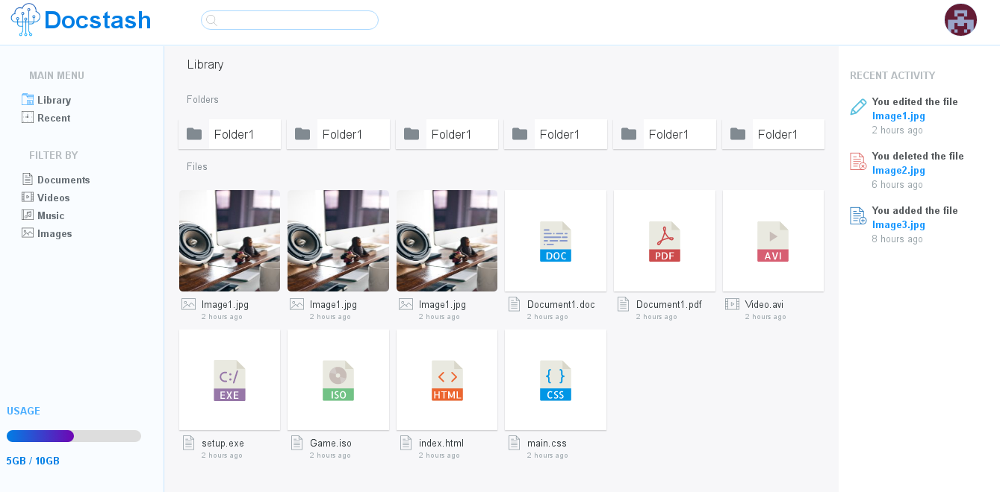
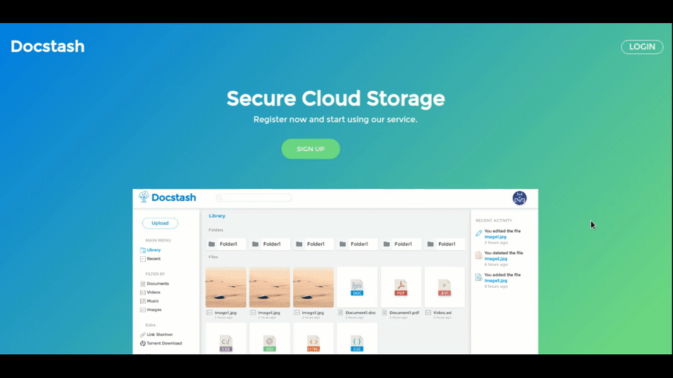
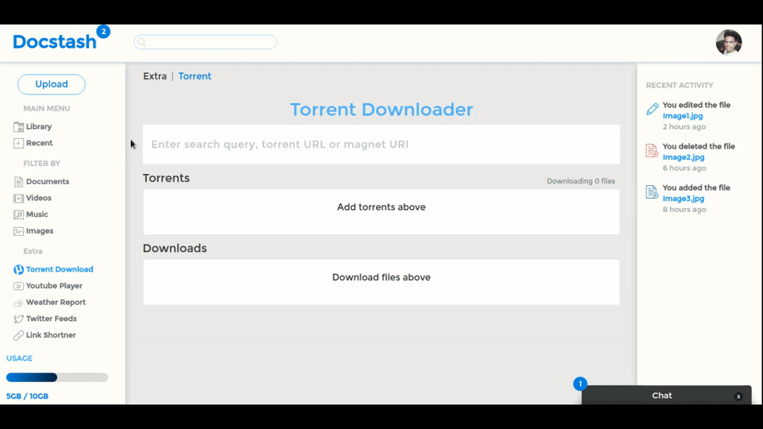

The project started as an idea for Final year project when I took the Cloud Computing as project domain. 
I wanted to use new technology in this project. Knowing web development the obvious choice was to go with JavaScript.

[Source Code](https://github.com/rakshans1/docstash)
#Technology Discovery
Before this project, I had no idea about Nodejs, React, NoSQL database.I did a few tutorial about each subject and finally decided the tech stack

After some research, I decided to go with 

**Front End**

* [React](https://facebook.github.io/react/)
* [Redux](https://github.com/reactjs/redux)

**Back End**

* [Nodejs](https://nodejs.org)
* [MongoDb](https://www.mongodb.com/)

* **Static Front End**

I Started working on the front end, making sketches and creating the static page after 2 to 3 week completed the initial static version 

* **User Authentication**

It was time to implement some backend in Node and I had thought of some initial features that will be provided like to download torrent in the cloud.
I used [Passport](http://passportjs.org/) for user auth, it has the comprehensive set of strategies that we can use.

* **Front end in React**

[Getting Started](https://facebook.github.io/react/tutorial/tutorial.html#getting-started) tutorial by Facebook is the great place to learn react fundamentals and paradigm.

I referred to [this starter kit](https://github.com/coryhouse/react-slingshot) to create my [webpack](https://webpack.github.io) build process.
As the static page was already created I was easy to implement in react. Added many things to front-end such as notification, loader and finally the authentication part was complete.

* **Backend**

As my backend is REST API I can run front-end and backend in different server. Later add features such as mail, enabled CORS so that it can work on a different domain, Social Login with Facebook and Google.
Added Link Shortner so that later user can share the link with friends.

* **Nosql Database**

I am using MongoDB as my database from [mlab](https://mlab.com/) which is Database as a service. Also a node module [mongoose](http://mongoosejs.com/) for creating schemas.

* **Torrent Downloading**

This feature may be the reason for choosing this project, it came as a need for me to download a torrent (like Linux distros). I found many amazing libraries like [torrent-stream](https://github.com/mafintosh/torrent-stream), [parse-torrent](https://github.com/feross/parse-torrent) which helped me to build the back end. Also used [Google Drive Sdk](https://github.com/google/google-api-nodejs-client) so that user can store torrent directly to google drive.

For the front-end, it was needed to show the real time update to user which [socket.io](http://socket.io/) help me to accomplish
Also added a torrent search engine to the front end or user can paste magnet link or upload a torrent file to start downloading.

