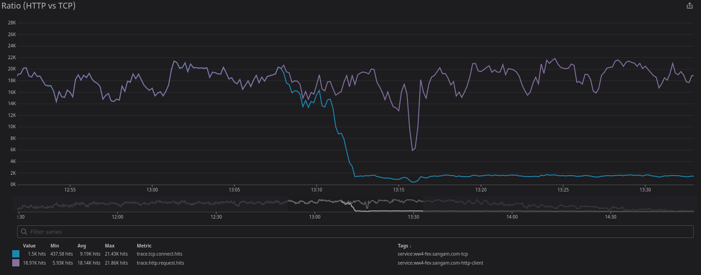
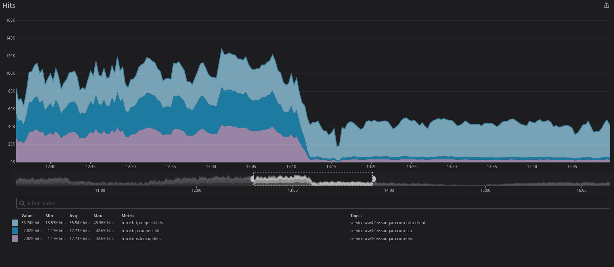
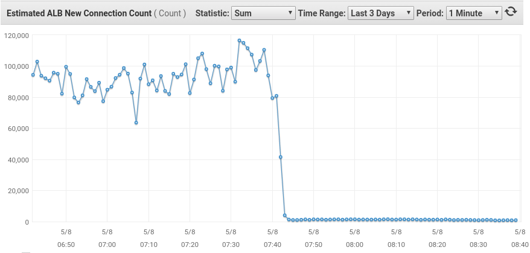

All the communication between microservices happens via an HTTP request.

For making a single HTTP request services perform the following things

1. Do the DNS query to get the IP address.
2. Create a TCP connection with IP.
3. Then Perform HTTP request.

This creates lots of overhead and redundancy to create a new TCP connection before each request. Especially with services that make a lot of outgoing HTTP requests.
We can avoid the first two steps if we reuse the TCP connections instead of doing the expensive TCP 3-way handshake and DNS query resolution.

## So what's the solution?

By enabling HTTP keep-alive we can reuse the existing connection.

But services built with Nodejs particularly have a problem because by default Node's HTTP library does not use Keep-Alive connections. At peak hours we saw one of our services makes around 200k req/min to our downstream services.

Nodejs allows us to create a custom agent for making HTTP requests. So we can create a new agent with keepAlive fag turned on

<div class="filename">native-http.js</div>

```javascript
import http from "http"
import https from "https"

const httpAgent = new http.Agent({ keepAlive: true })

const options = {
  hostname: "www.google.com",
  path: "/",
  agent: httpAgent,
}

const req = http.request(options, (res) => {
    res.on('data', (chunk ) => {
      ...
    })
})
```

<div class="filename">axios.js</div>

```javascript
import http from "http"
import https from "https"
import axios from "axios"

const httpAgent = new http.Agent({ keepAlive: true })
const httpsAgent = new https.Agent({ keepAlive: true })

const api = axios.create({
  baseURL: "http://google.com",
  httpAgent,
  httpsAgent,
})

export default api
```

## Benefits of using HTTP keep-alive

- We saw almost 25% reduction in container count required to handle the same amount workloads.
- Reduced TCP connection and DNS queries by a large amount.
- Reduced New Connection count in ELB of downstream services.
- Less strain to our DNS service and don't hit AWS DNS limits.








</div>
